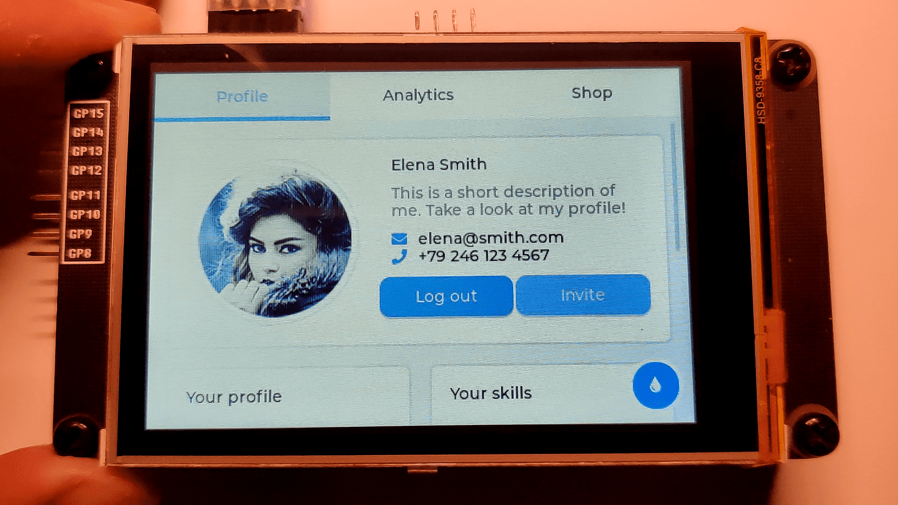
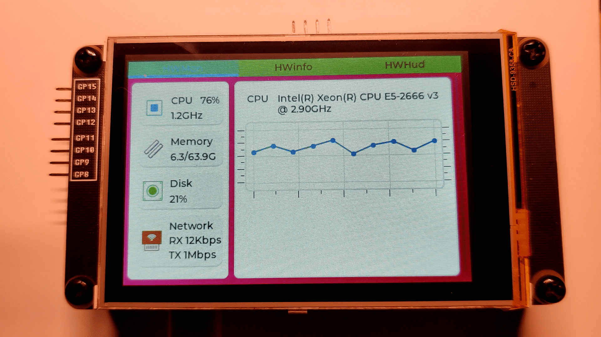

> <h1 align="center">Pico DM FPC032MRA003<h1>

> <h1 align="center">"最具性价比的LVGL开发板之一"</h1>

> <h3 align="center">Pico_DM_FPC032MRA003 是基于树莓派 Pico 核心板设计的一款超低成本显示拓展板，分辨率为480x320，专用于学习、评估、开发LVGL或其他GUI应用。 </h3>

> <h4 align="center">本产品起价29.8￥，在bilibili工房下单享受更低粉丝优惠价～</h4>

视频链接：[[bilibili.com](https://www.bilibili.com/video/BV18D421T7gM)](https://www.bilibili.com/video/BV18D421T7gM)

文档链接：[http://embeddedboys.com/Pico_DM_FPC032MRA003/](http://embeddedboys.com/Pico_DM_FPC032MRA003/)

> <h3 align="center"> 支持使用 pico-sdk 或 MicroPythona 开发 </h3>

玩得开心！ 
干杯, 

<h2 align="center">
      
    
</h2>
<h2 align="center">
    <a href="https://embeddedboys.github.io/">embeddedboys</a> 献上
</h2>
